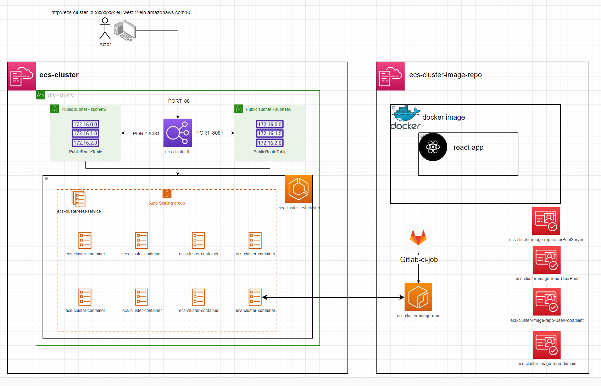
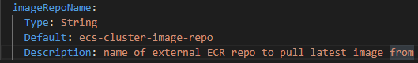
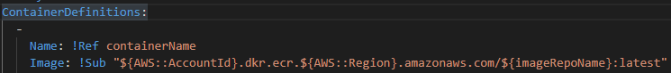
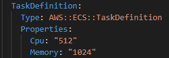
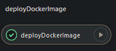
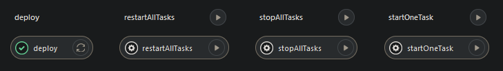

# ecs-cluster & ecs-cluster-image-repo are individual repositories / AWS stacks

## ecs-cluster
ecs-cluster can be deployed on its own given the `imageRepoName` parameter is updated to point to an already existing image / ECR repo  
  
  

Changing the image might need more resources to be assigned to the Task Defination  

---

# Setup
first, deploy `ecs-cluster-image-repo` to AWS then run the `deployDockerImage` Gitlab Job to publish the react-app as a docker image to an ECR repository  
  

This job will also run the `scripts/envs.sh` bash script that appends `NEXT_PUBLIC_` to all AWS stack outputs, saves them all to a .env file and compiles it into the docker image for dynamic use of variables inside the image instead of hardcoding values.  

The docker image also exposes port 8081 which the `ecs-cluster` directs web traffic to.  

secondly, deploy `ecs-cluster` to AWS. The deployment will automatically create an ECS service with a running task. This task can be accessed via the load balancer DNS name that is exported as an output of the `ecs-cluster` stack. e.g. `http://ecs-cluster-lb-12345678.eu-west-2.elb.amazonaws.com/`  

The `ecs-cluster` gitlab jobs can also be used to administrate ECS  

`restartAllTasks` - gets the number of tasks running e.g. 3 then launches 3 more while shutting down the previous 3. This process will refresh the image in the task if the image has been updated.  

`stopAllTasks` - stops all tasks to save costs  

`startOneTask` - starts 1 task  
